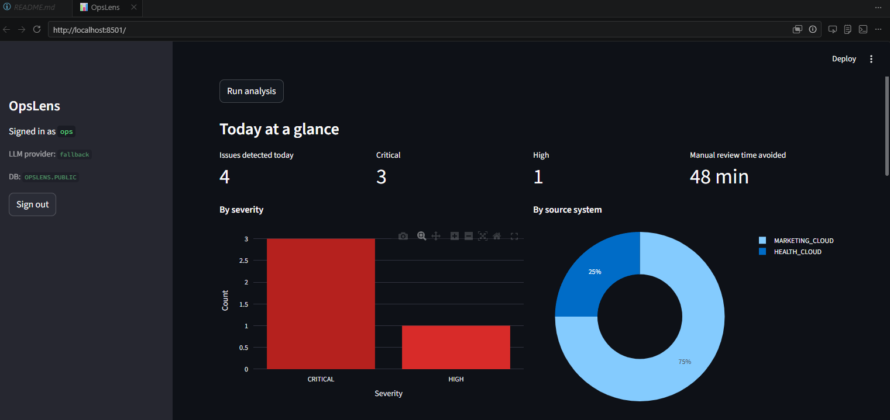
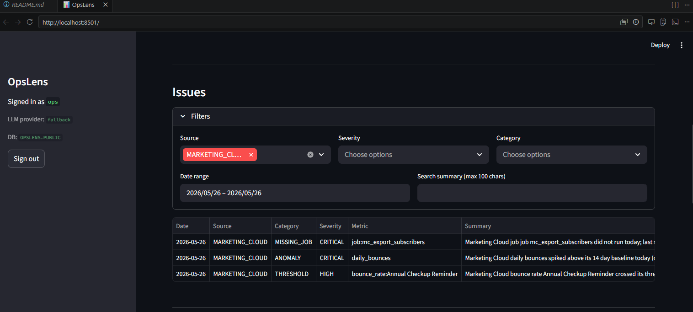
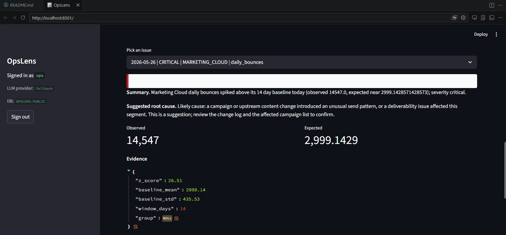
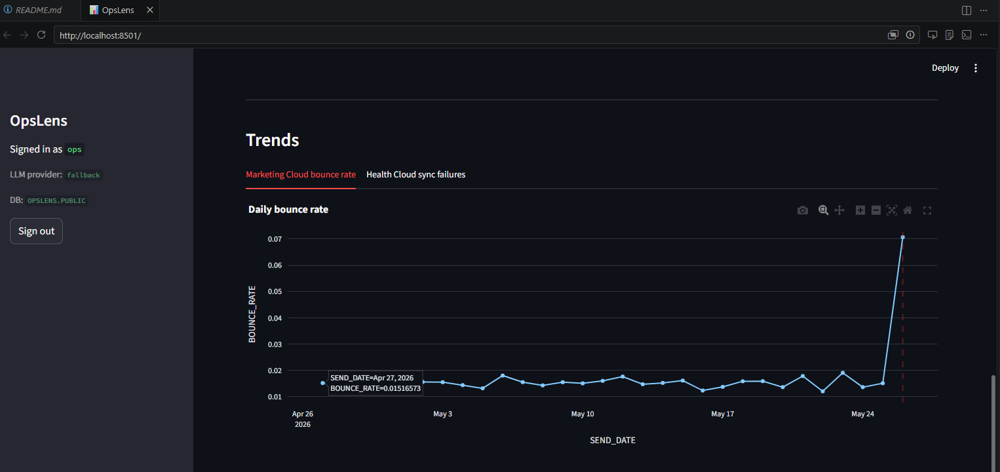

# OpsLens

An AI assisted operations monitoring assistant for companies whose Salesforce Marketing Cloud and Salesforce Health Cloud data is exported to Snowflake every day. OpsLens reads the latest data each morning, detects failures and anomalies across both source systems, explains every issue in plain English with a suggested root cause, and delivers the results to the operations team through two channels: a daily email digest pushed at 8:30 AM and a Streamlit dashboard the team can drill into any time.
My 10min Demo Script: "DEMO_SCRIPT.md"

## Screenshots

<table>
  <tr>
    <td align="center"><b>Overview</b><br></td>
    <td align="center"><b>Issues list</b><br></td>
  </tr>
  <tr>
    <td align="center"><b>Detail view with AI summary and root cause</b><br></td>
    <td align="center"><b>Trends with anomaly day marked</b><br></td>
  </tr>
</table>

## The problem

The morning routine for an operations team looks like this: sign in to Snowflake, scroll through job lists across two source systems, eyeball a couple of dashboards, ask each other whether yesterday looked normal. It is slow, it does not scale, and the failure modes that matter most (a missing reconciliation, a quiet bounce-rate creep) are exactly the ones a human is most likely to miss. OpsLens flips that workflow. The system tells the team what changed, in one sentence, and points at a likely cause. The human moves straight to triage.

## Architecture

```
Mock data generator
        |
        v
Snowflake RAW tables   (Marketing Cloud + Health Cloud daily exports)
        |
        v
Analysis engine        (detectors + reconciliation checks)
        |
        v
LLM enrichment         (plain English summary + suggested root cause)
        |
        v
Snowflake OPS_INSIGHTS (single source of truth for findings)
        |
        +-------------------+
        |                   |
        v                   v
  Email digest        Streamlit dashboard
  (daily push)        (drill-in UI)
```

The engine is decoupled from delivery on purpose. The dashboard and the email digest are thin readers over `OPS_INSIGHTS`, so they can never disagree, and the LLM cost is paid once per run instead of once per page view. Both channels can be extended (Slack, Teams, a webhook) without touching the engine.

Full design notes, alternatives considered, and production scheduling options are in [ARCHITECTURE.md](ARCHITECTURE.md).

## What the engine detects

| Category | What it catches |
| --- | --- |
| Rolling-baseline anomaly | Daily totals that breach a z-score threshold against a 14 day baseline, per system and per group |
| Failed job | Any job that ran today and finished with status `FAILED` |
| Missing job | A job that ran on prior days but did not run today |
| Threshold breach | A rate (bounce rate, sync failure rate) above a configurable percent |
| Reconciliation mismatch | Exported count diverges from loaded count beyond a noise floor |

Every detector returns a structured finding; the LLM layer is what turns it into one sentence of plain English plus a labelled root-cause suggestion.

## How AI is used in operations here

Two places, both deliberate.

1. **Plain English summary.** A non-technical operations manager reads the digest at 8:30 AM. They get one sentence per issue, not a stack trace. That is the deliverable.
2. **Suggested root cause.** Every insight ships with a labelled "Likely cause" line that combines the finding's pattern with the recent history. The wording is intentionally cautious; the model is told to suggest, not assert.

Three providers are supported (OpenAI, Anthropic, Hugging Face) behind a single interface. The chosen provider is configurable. When no API key is configured for the chosen provider, a deterministic template provider takes over so the system never hard fails. That is the difference between a demo that works in any environment and one that does not.

## Feature map

| Required capability | Where it lives |
| --- | --- |
| Detect anomalies and operational issues | [src/engine/detectors.py](src/engine/detectors.py), [src/engine/reconciliation.py](src/engine/reconciliation.py) |
| Plain English summaries | [src/llm/](src/llm/) (base, OpenAI, Anthropic, Hugging Face, deterministic fallback) |
| Suggested root causes | Same module, `suggest_root_cause` on every provider |
| Operational dashboard | [dashboard/app.py](dashboard/app.py) |
| AI driven efficiency | "Manual review time avoided" tile plus the 8:30 AM push that removes the need to go looking |

## Production thinking

A few decisions worth flagging because they matter more in a real deployment than they look on a demo.

- **One persisted insights table, two readers.** The dashboard and the digest both read from `OPS_INSIGHTS`. If the LLM were called from the dashboard, the inbox and the screen could drift; if it were called from the digest, the dashboard could not show fresh insights. Persisting the enriched text is what keeps the two channels honest and the cost predictable.
- **Detectors return structured findings, not text.** Swapping providers, tuning prompts, or running a re-enrichment pass touches one module. The detection logic stays deterministic and unit testable.
- **Engine operates on DataFrames.** At small daily volumes this is the simplest thing that works. If volumes grew an order of magnitude the same detectors translate to Snowpark or pushdown SQL without changing their callers.
- **Scheduling is intentionally out of the repo.** A real deployment lives on a Snowflake Task (recommended; SQL skeleton in [ARCHITECTURE.md](ARCHITECTURE.md)), a cron runner, or whatever orchestrator the team already trusts. The right choice depends on the customer's stack, and shipping one choice would imply a recommendation that may not fit.
- **A deterministic fallback for the LLM.** Without it, a missing API key would mean a hard demo failure and a hard production failure during a provider outage. The fallback path means the system continues to ship findings even when the AI layer is unreachable.

## Security

A full audit lives in [SECURITY.md](SECURITY.md). The short version:

1. **Sliding window rate limiter and lockout.** Five failed logins in 15 minutes lock the user; the "Run analysis now" action is throttled to protect LLM cost.
2. **Secret scanner wired into pre-commit.** Patterns for OpenAI, Anthropic, Hugging Face, AWS, bearer tokens, inline password assignments, and Snowflake credential literals. Exits non-zero on a hit.
3. **Environment-only secrets.** Every credential is read once in `src/config.py`. The dashboard password is stored only as a bcrypt hash.
4. **Pydantic input validation everywhere.** Allow-lists on dropdown fields, size caps on free text, hard bounds on date ranges, parameterized queries on every database call.
5. **Honest residual-risk section.** What is sufficient for a POC, what would change for production (SSO, network policy, row and column access control on PHI, audit trail).

## Efficiency narrative

The line on the overview tile is the simplest model of the value: `issues_detected * minutes_per_manual_issue`. The harder benefit is consistency. The system never forgets to check the reconciliation tab on a Friday afternoon, never misses a missing job because it was a long week, never under-weighs a quiet bounce-rate creep that does not look like a fire. That consistency is the thing AI buys an operations team that hiring more humans cannot.

## Tech stack

Snowflake (raw exports and the insights table), Python 3.11+, Streamlit (dashboard), an LLM provider behind a swappable interface (OpenAI default, Anthropic and Hugging Face supported, deterministic template fallback when no key is present), SMTP for the digest, mock datasets generated by the project itself.

## Repository layout

```
opslens/
  README.md, ARCHITECTURE.md, SECURITY.md, DEMO_SCRIPT.md, BUILD_LOG.md
  src/
    config.py, snowflake_client.py
    mock_data/    schemas.py, generate.py
    engine/       detectors.py, reconciliation.py, pipeline.py
    llm/          base.py, openai_provider.py, anthropic_provider.py, huggingface_provider.py, fallback.py, factory.py
    insights/     models.py, store.py
    email_digest/ render.py, send.py, templates/digest.html
    security/     rate_limiter.py, validation.py, auth.py
  dashboard/app.py
  scripts/        setup_snowflake.py, load_mock_data.py, run_analysis.py, send_digest.py, scan_secrets.py
  tests/          test_detectors.py, test_rate_limiter.py, test_validation.py
  screenshots/
```

## Demo

A 10 minute walkthrough script for the live demo is in [DEMO_SCRIPT.md](DEMO_SCRIPT.md). The decisions made during the build, the order, and the non-obvious engineering choices are in [BUILD_LOG.md](BUILD_LOG.md).

## Testing

`pytest` covers the detection logic against fixed series, the rate limiter (lockout after five failures, recovery after the window, per-key isolation), and the input-validation models (oversized, malformed, and out-of-range inputs are rejected). External boundaries (Snowflake, LLM, SMTP) are mocked so tests run anywhere without credentials.
